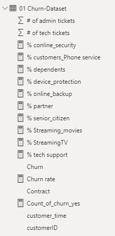
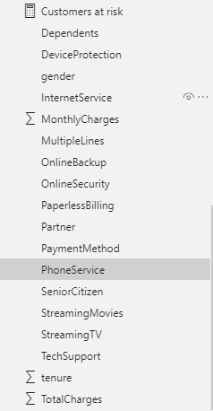
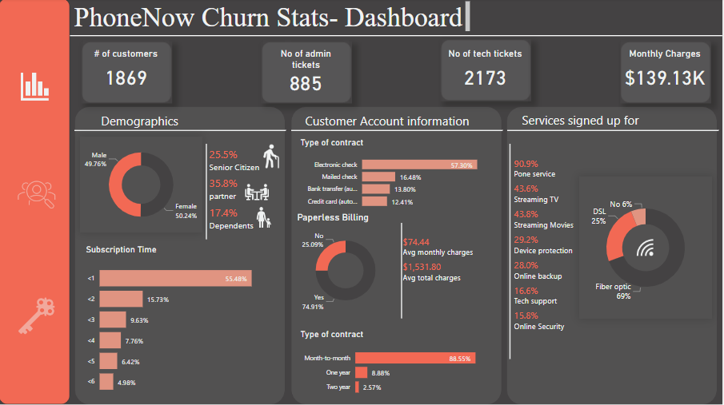
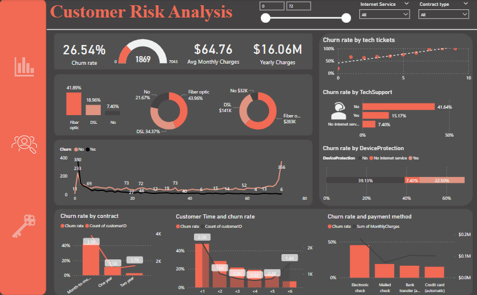
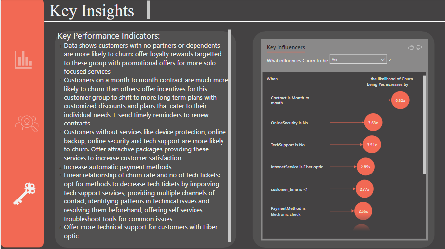

# PwC-PowerBI
Customer Retention Dashboard

This was project 2 of the Virtual internship where a dashboard was required. The context of the business problem was provided as follows:

  

The following inputs were provided:

  

The data set was an excel file with multiple columns. The data was uploaded to PowerBI and required measures were created: 

  

  

  

  

  
</p

The complete interactive dashboard can be accessed [here](https://app.powerbi.com/links/qFjd5i5cad?ctid=402d2a37-422a-4cb6-9563-6afdf0cd3a39&pbi_source=linkShare)
